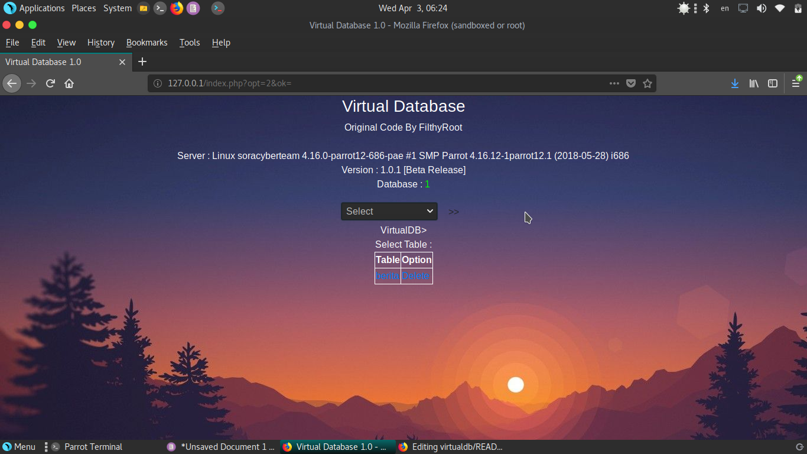

# Virtual Database 
Virtual Database yaitu program database virtual pengganti MySQL<br>
Implementasi program ini mirip dengan MySQL tetapi agak berbeda<br><br>
Cara mengimplementasi program ini yaitu :<br>
1. Lakukan include pada file virtualdb/config.php ke dalam project anda.<br>
2. Misal anda ingin membuat table, anda bisa menggunakan VirtualDB Manager (virtualdb/index.php)<br>
   atau anda juga bisa langsung membuat pada project anda dengan cara :<br>
   
   ```
   <?php
   //Contoh membuat table berita
   include 'virtualdb/config.php' //include config virtualdb
   //mulai menulis table berita
   $fh=fopen('virtualdb/db.php','a');
   fwrite($fh,'array_push($db[\''.$database_id.'\'],\'berita\');'); //nama table = berita. menulis table berita pada database
   fwrite($fh,"\n");
   fwrite($fh,'$db[\''.$database_id.'\'][\'berita\']=array();'); //table berita siap menampung data.
   fwrite($fh,"\n");
   fclose($fh);
   ?>
   ```

3. Misal anda ingin membuat column pada table berita yang sudah dibuat, caranya seperti ini :<br>
```
  <?php
  //membuat column judul,images,author pada table berita yang sudah dibuat tadi
  include 'virtualdb/config.php';
  //mulai menulis column
  $fh=fopen('virtualdb/db.php','a');
  fwrite($fh,'array_push($db[\''.$database_id.'\'][\'berita\'],\'judul\');'); //membuat column judul
  fwrite($fh,"\n");
  fwrite($fh,'array_push($db[\''.$database_id.'\'][\'berita\'],\'images\');'); //membuat column images
  fwrite($fh,"\n");
  fwrite($fh,'array_push($db[\''.$database_id.'\'][\'berita\'],\'author\');'); //membuat column author
  fwrite($fh,"\n");
  fwrite($fh,'$db[\''.$database_id.'\'][\'berita\'][\'judul\']=array();'); //column judul siap menampung data
  fwrite($fh,"\n");
  fwrite($fh,'$db[\''.$database_id.'\'][\'berita\'][\'images\']=array();'); //column images siap menampung data
  fwrite($fh,"\n");
  fwrite($fh,'$db[\''.$database_id.'\'][\'berita\'][\'author\']=array();'); //column author siap menampung data
  fwrite($fh,"\n");
  fclose($fh);
  ?>
  ```
4. Misal anda ingin menulis data pada column, anda bisa melakukan seperti ini :<br>

  ```
  <?php
  //menulis data ke dalam column 
  //in this case, misal kita ingin menulis 'Hacker Tampan Berhasil Transgender' kedalam $db['virtual_db']['berita']['judul']
  //mulai menulis data
  $fh=fopen('virtualdb/db.php','a');
  fwrite($fh,'array_push($db[\''.$database_id.'\'][\'berita\'][\'judul\'],\'Hacker Tampan Berhasil Transgender\');'); //menulis
  fclose($fh); // langsung close karena item pada column (Hacker Tampan Berhasil Transgender) tidak menampung data lagi.
  ?>
  ```
5. Anda ingin menghapus table,column,item pada virtualdb?<br>
Lebih baik gunakan VirtualDB Manager (/virtualdb/index.php)<br>
<br><br>
Screenshot :<br>
<br>
Copyright &copy 2019 FilthyRoot@socyte.space
